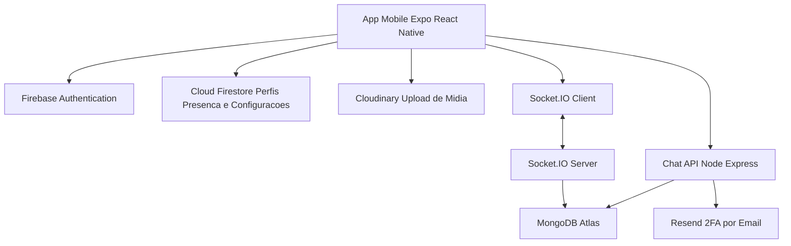

# Documentacao da Aplicacao de Chat Instantaneo

## 1. Objetivo da Atividade

Este documento apresenta a documentacao tecnica do aplicativo `Vibe`, uma aplicacao mobile de chat instantaneo inspirada em mensageiros como Telegram e WhatsApp. O objetivo e registrar requisitos, arquitetura, tecnologias, integracoes externas, funcionalidades implementadas e evolucoes realizadas no sistema.

### Objetivos especificos
- Desenvolver a habilidade de documentar sistemas de software.
- Compreender e registrar requisitos funcionais e nao funcionais.
- Consolidar as evolucoes tecnicas de um sistema de chat realista.
- Organizar a documentacao para futura entrega em PDF.

## 2. Contexto do Projeto

O projeto `Vibe` foi desenvolvido em `React Native` com `Expo`, com foco em comunicacao em tempo real entre usuarios. O sistema permite autenticacao, gerenciamento de conta, troca de mensagens privadas, envio de midia, controle de presenca, indicador de digitacao e sincronizacao entre servicos externos.

A aplicacao utiliza uma arquitetura hibrida composta por:
- `Firebase Authentication` para autenticacao principal do usuario.
- `Cloud Firestore` para perfis, configuracoes e presenca online/offline.
- `Chat API propria` em `Node.js`, `Express`, `MongoDB` e `Socket.IO` para conversas, mensagens, anexos e eventos em tempo real.
- `Cloudinary` para upload e armazenamento de imagens e arquivos de midia.
- `Resend` no backend para suporte ao envio de codigos por e-mail no fluxo de verificacao em duas etapas (2FA).

## 3. Requisitos Funcionais

### RF01: Envio de mensagens de texto
A aplicacao permite que usuarios autenticados enviem e recebam mensagens de texto em tempo real.

### RF02: Envio de imagens, videos e arquivos
O usuario pode anexar arquivos pela galeria, camera ou seletor de documentos. Esses arquivos sao enviados para o Cloudinary e vinculados as mensagens do chat.

### RF03: Criacao de grupos de conversa
A interface possui estrutura para criacao de grupos e navegacao relacionada. O backend pode ser expandido para suportar grupos completos.

### RF04: Autenticacao de usuarios
O acesso e protegido por autenticacao com Firebase. A sessao do chat e sincronizada com a API customizada para habilitar mensagens, anexos e eventos em tempo real.

### RF05: Notificacoes em tempo real
O sistema atualiza a interface em tempo real por `Socket.IO` e apresenta notificacoes visuais para novas mensagens.

### RF06: Verificacao em duas etapas
O sistema possui fluxo de configuracao e verificacao em duas etapas, com envio de codigo por e-mail via backend integrado ao `Resend`.

## 4. Requisitos Nao Funcionais

### RNF01: Seguranca na comunicacao
A autenticacao utiliza tokens, controle de acesso e isolamento de variaveis sensiveis por ambiente. A verificacao em duas etapas reforca a protecao da conta.

### RNF02: Alta disponibilidade do sistema
A API foi preparada para deploy em nuvem com `MongoDB Atlas` e `Render`, permitindo acesso remoto e execucao fora do ambiente local.

### RNF03: Baixa latencia nas mensagens
O uso de `Socket.IO` reduz o tempo entre envio e recebimento das mensagens, mantendo a experiencia de chat em tempo real.

### RNF04: Escalabilidade para multiplos usuarios
A separacao entre autenticacao, persistencia, notificacoes, upload de arquivos e tempo real permite crescimento modular da aplicacao.

### RNF05: Interface amigavel e responsiva
O app foi desenvolvido para dispositivos moveis com foco em usabilidade, navegacao fluida e experiencia visual proxima de aplicativos de mensageria modernos.

## 5. Arquitetura da Aplicacao

A arquitetura do projeto e dividida em frontend mobile, backend de chat e servicos externos.



### 5.1 Frontend mobile
O frontend concentra:
- telas de autenticacao, configuracao e conversas;
- consumo da API REST de chat;
- conexao em tempo real com `Socket.IO`;
- controle de sessao do usuario;
- upload de foto de perfil e arquivos de conversa;
- integracao com galeria, camera, documentos e contatos.

### 5.2 Backend de chat
A API customizada concentra:
- sincronizacao de usuario autenticado;
- criacao e listagem de conversas;
- envio, leitura, atualizacao e exclusao de mensagens;
- upload e referencia de midia;
- eventos de digitacao, presenca e mensagens em tempo real;
- endpoints de apoio ao fluxo de verificacao em duas etapas.

### 5.3 Servicos externos
- `Firebase`: autenticacao principal e parte dos dados do usuario.
- `Firestore`: presenca, perfil e configuracoes da conta.
- `MongoDB Atlas`: persistencia de conversas e mensagens.
- `Cloudinary`: armazenamento e entrega de imagens e arquivos.
- `Resend`: envio de codigo por e-mail para verificacao adicional.

## 6. Tecnologias Utilizadas

### Frontend
- `React Native`
- `Expo`
- `TypeScript`
- `React Navigation`
- `Socket.IO Client`
- `Firebase`
- `AsyncStorage`
- `expo-image-picker`
- `expo-document-picker`
- `expo-contacts`
- `react-native-toast-message`

### Backend integrado
- `Node.js`
- `Express`
- `MongoDB`
- `Mongoose`
- `Socket.IO`
- `JWT`
- `Multer`

### Integracoes externas
- `Cloudinary` para upload e armazenamento de midia.
- `Resend` para envio de e-mails no fluxo de 2FA.
- `MongoDB Atlas` para banco em nuvem.
- `Render` para hospedagem da API.

## 7. Descricao do que Foi Desenvolvido

### 7.1 Autenticacao
O usuario realiza cadastro e login com Firebase. Depois disso, a aplicacao sincroniza ou cria a sessao correspondente na API de chat e salva o token localmente para chamadas autenticadas.

### 7.2 Conversas
A lista de chats exibe conversas do usuario autenticado. Ao selecionar um contato, a aplicacao cria ou reutiliza a conversa existente e navega para a tela de mensagens.

### 7.3 Mensagens em tempo real
A tela de chat consome mensagens anteriores via REST e recebe novas mensagens via `Socket.IO`. O envio ocorre por texto ou por arquivo, com atualizacao quase imediata da interface.

### 7.4 Midia, fotos e anexos
Foi implementado fluxo de anexo por galeria, camera e arquivo. O app faz upload da midia para o `Cloudinary`, recebe a URL final do recurso e envia essa referencia para a conversa. O mesmo padrao tambem e utilizado em partes do perfil, como foto do usuario e imagem de grupo.

### 7.5 Presenca e digitacao
Foi implementado indicador de `digitando...` e controle de presenca online/offline. O status e atualizado com base no ciclo de vida do aplicativo e refletido na interface do chat.

### 7.6 Configuracoes do usuario
O projeto possui telas de perfil, configuracao, privacidade, notificacoes, dados e armazenamento, alem de fluxos para alteracao de telefone e username.

### 7.7 Verificacao em duas etapas
O aplicativo possui suporte a `2FA`, incluindo configuracao local no perfil do usuario e envio de codigo por e-mail a partir da API de chat. O backend integra esse envio com o servico `Resend`.

## 8. Melhorias, Manutencoes e Atualizacoes

Ao longo do desenvolvimento, as seguintes melhorias foram realizadas:

### Melhorias implementadas
- Migracao de uma solucao de chat terceirizada para uma API propria.
- Integracao entre Firebase e backend customizado.
- Adicao de envio de arquivos, fotos e imagens no chat.
- Integracao com `Cloudinary` para armazenamento externo de midia.
- Criacao de notificacoes in-app para novas mensagens.
- Implementacao de icones customizados para build Android.
- Estruturacao do fluxo de verificacao em duas etapas com apoio do backend.

### Correcoes de bugs
- Correcao do crash do APK causado por variaveis de ambiente ausentes no build.
- Ajuste do fluxo de autenticacao para recuperar a sessao do chat apos login.
- Correcao do indicador de digitacao com eventos `Socket.IO` mais robustos.
- Correcao do status online/offline com monitoramento por `AppState`.
- Inclusao da rota de exclusao de conversas no backend para evitar erro `404`.

### Novas funcionalidades adicionadas
- Exclusao de conversa por long press na lista de chats.
- Exclusao de conversa pelo menu de tres pontos dentro do chat.
- Upload de documentos e imagens diretamente pela tela de conversa.
- Sincronizacao de contatos e uso de notificacoes visuais dentro do app.
- Suporte a fotos de perfil e imagem de grupo usando `Cloudinary`.
- Fluxo de 2FA com envio de codigo por e-mail.

### Mudancas de performance e seguranca
- Reforco da validacao de participantes no backend `Socket.IO`.
- Uso de token JWT para proteger endpoints da API.
- Separacao clara entre dados de autenticacao, presenca, configuracoes e mensagens.
- Estruturacao da aplicacao para deploy em nuvem com ambiente configuravel.
- Armazenamento de arquivos fora da aplicacao principal, reduzindo carga direta sobre o backend.

## 9. Estrutura Resumida do Projeto

```text
telegram-clone/
|- src/
|  |- components/
|  |- config/
|  |- context/
|  |- hooks/
|  |- navigation/
|  |- screens/
|  |- services/
|  |- theme/
|  |- types/
|  |- utils/
|- assets/
|- app.json
|- app.config.ts
|- eas.json
|- .env.example
```

## 10. Variaveis de Ambiente

O projeto depende de variaveis configuradas no `.env` e tambem no ambiente de build do Expo.

### Firebase
```env
EXPO_PUBLIC_FIREBASE_API_KEY=...
EXPO_PUBLIC_FIREBASE_AUTH_DOMAIN=...
EXPO_PUBLIC_FIREBASE_PROJECT_ID=...
EXPO_PUBLIC_FIREBASE_STORAGE_BUCKET=...
EXPO_PUBLIC_FIREBASE_MESSAGING_SENDER_ID=...
EXPO_PUBLIC_FIREBASE_APP_ID=...
```

### Chat API
```env
EXPO_PUBLIC_CHAT_API_URL=https://sua-api.onrender.com/
```

### Cloudinary
```env
EXPO_PUBLIC_CLOUDINARY_CLOUD_NAME=...
EXPO_PUBLIC_CLOUDINARY_UPLOAD_PRESET=...
EXPO_PUBLIC_CLOUDINARY_API_URL=https://api.cloudinary.com/v1_1/seu_cloud_name/auto/upload
```

### Observacao sobre 2FA
O fluxo de 2FA depende de suporte no backend. O aplicativo consome o endpoint de envio de codigo, enquanto a integracao com `Resend` fica configurada do lado da API.

## 11. Como Executar o Projeto

### Ambiente local
```bash
npm install
npx expo start
```

### Build Android
```bash
eas build -p android --profile preview
```

## 12. Consideracoes Finais

O projeto documentado apresenta uma aplicacao de chat instantaneo com arquitetura moderna, integrando frontend mobile, autenticacao gerenciada, presenca em tempo real, persistencia em nuvem, upload externo de midia e verificacao adicional por e-mail. A solucao atende aos principais requisitos propostos pela atividade e demonstra evolucao continua por meio de correcoes, melhorias de usabilidade, ajustes de seguranca e ampliacao funcional.

## 13. Entrega em PDF

Para a entrega em PDF, este README pode ser convertido diretamente para PDF a partir do GitHub, VS Code ou navegador, preservando a estrutura da documentacao.
