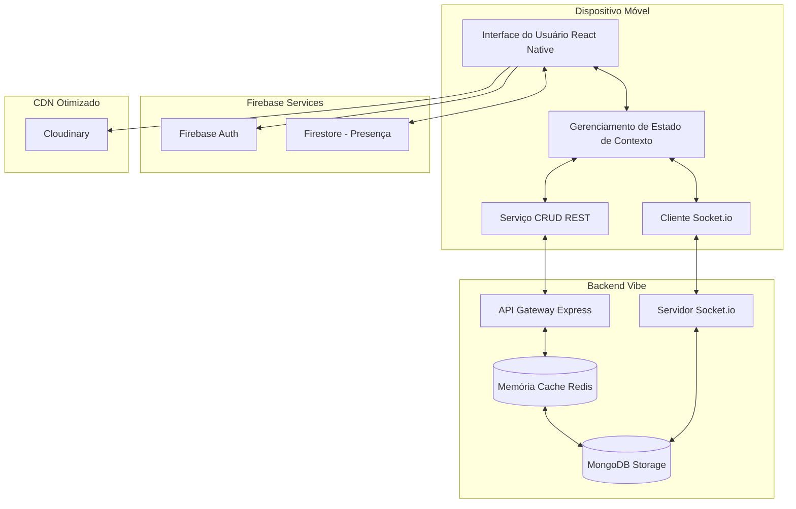

#  Vibe - Documentação Completa do App Frontend

O **Vibe** é um aplicativo móvel de mensagens instantâneas focado em alta performance e design premium, com uma interface que espelha os padrões modernos de UX/UI vistos no Telegram.

---

##  Índice
1. [Visão Geral](#1-visão-geral)
2. [Arquitetura Otimizada (Redis e RT)](#2-arquitetura-otimizada-redis-e-rt)
3. [Guia de Funcionalidades](#3-guia-de-funcionalidades)
4. [Estrutura de Pastas](#4-estrutura-de-pastas)
5. [Tecnologias Utilizadas](#5-tecnologias-utilizadas)
6. [Variáveis de Ambiente](#6-variáveis-de-ambiente)
7. [Como Executar o Projeto Localmente](#7-como-executar-o-projeto-localmente)
8. [Fluxos do Aplicativo](#8-fluxos-do-aplicativo)
9. [Build e Publicação](#9-build-e-publicação)

---

## 1. Visão Geral
Este repositório contém todo o frontend móvel em React Native (Expo). A aplicação atua como a interface interativa do usuário, cuidando da autenticação no lado do cliente (Firebase), navegação nativa, armazenamento em cache de mídias e conexão bidirecional WebSockets com a Chat API.

---

## 2. Arquitetura Otimizada (Redis e RT)
A arquitetura do Vibe é desenhada para reduzir o processamento no dispositivo móvel e usar a rede de forma inteligente.



### O impacto do Redis no Mobile:
Embora o Redis viva no Backend, o impacto no frontend é drástico. Quando o app solicita `getConversations`, a API retorna em **~10ms a ~30ms** carregando diretamente do Redis, garantindo que a tela inicial da lista de chats carregue instantaneamente após abrir o app, ao invés do usuário testemunhar uma barra de loading lenta aguardando o banco do servidor.

---

## 3. Guia de Funcionalidades

###  Autenticação, Perfis e 2FA
*   **Sign Up/Sign In Seguros:** Login via email e senha usando o Firebase.
*   **Verificação de 2 Passos (2FA):** Proteção superior disparando envio de código para o email via Resend por meio da Chat API.
*   **Painel de Perfil Inteligente:** Atualização customizada de avatares com recortes (Image Picker) fazendo upload direto para nuvem (Cloudinary) sem pesar a API.

###  Sistema de Conversas (Chats)
*   **Conversa 1x1:** Troca de mensagens entre usuários privados usando rotas com IDs únicas do Socket.
*   **Conversa em Grupos:** Seleção de múltiplos contatos e suporte de "Group Profile" para visualização de mídias enviadas, membros e administrador do grupo.
*   **Sincronização com Contatos:** Integra-se à agenda do dispositivo para identificar rapidamente quem possui o app.

###  Funcionalidades "Premium" do Chat
*   **Real Time Typing Status:** Visual de "Digitando..." alimentado globalmente por sockets da sala específica.
*   **Online/Offline Badge:** Acompanhamento do `AppState` no mobile para registrar e transmitir estado do dispositivo.
*   **Confirmação de Leitura (Check Duplo):** Implementação de visuais customizáveis na Message Bubble para "enviado" e "Visto" (`read`).
*   **Áudios Nativos e Arquivos:** Funcionalidade de record/stop de áudio com Expo AV; Picker universal de documentos e renderização de fotos/vídeos enfileirados no Cloudinary.

---

## 4. Estrutura de Pastas

```text
src/
  components/     # Todos os blocos visuais menores (Input, Botões, ChatBabble, Avatar)
  config/         # Ficheiros mestres de configuração (Firebase, config API global)
  context/        # Providers globais (AuthContext, ChatContext, ThemeContext)
  hooks/          # React Custom Hooks p/ reaproveitamento de regras de negócio
  navigation/     # Configuração das Árvores de Navegação (Stack/Tab) do React Navigation
  screens/        # Containers Maiores das Telas (ChatScreen, Login, Contacts, etc)
  services/       # Clientes HTTP e wrappers de SDK (chatApi.ts, cloudinaryService.ts)
  theme/          # Padronagem central do Design System (Cor, Fonte) estilo Telegram
  types/          # Definições Typescript para inteligência IDE e Prevenção de Erros
  utils/          # Handlers matemáticos ou de string (Formatação de Data, Truncamentos)
```

---

## 5. Tecnologias Utilizadas
*   `React Native (Expo)` e `Typescript`: Fundamento central.
*   `@react-navigation/native`: Fluxos complexos de troca de telas.
*   `socket.io-client`: Escuta persistente para WebSockets.
*   `firebase`: Conector Mobile SDK do Firebase.
*   `expo-image-picker` e `expo-document-picker`: Interação com sistema de arquivos nativos Ios/Android.
*   `expo-av`: API nativa de áudio.

---

## 6. Variáveis de Ambiente
Antes de buildar, configure o `.env` na raiz do projeto usando o `.env.example` como base.
As chaves abaixo refletem o que o app usa hoje:

```env
# 1. Firebase (Consulte o Console do Firebase Web Setup)
EXPO_PUBLIC_FIREBASE_API_KEY=sua_api_key
EXPO_PUBLIC_FIREBASE_AUTH_DOMAIN=projeto.firebaseapp.com
EXPO_PUBLIC_FIREBASE_PROJECT_ID=nome-projeto
EXPO_PUBLIC_FIREBASE_STORAGE_BUCKET=storage-bucket-url
EXPO_PUBLIC_FIREBASE_MESSAGING_SENDER_ID=0000000000
EXPO_PUBLIC_FIREBASE_APP_ID=1:id:web:hash

# 2. Endereço da Máquina/Nuvem do seu Backend
EXPO_PUBLIC_CHAT_API_URL=https://sua-api.onrender.com/

# 3. Cloudinary CDN Keys (Painel da Cloudinary)
EXPO_PUBLIC_CLOUDINARY_CLOUD_NAME=nome_cloud
EXPO_PUBLIC_CLOUDINARY_UPLOAD_PRESET=unsigned_preset

# Opcional: se não informar, o app monta a URL automaticamente
EXPO_PUBLIC_CLOUDINARY_API_URL=https://api.cloudinary.com/v1_1/nome_cloud/auto/upload
```

---

## 7. Como Executar o Projeto Localmente

1. **Dependências:** Execute `npm install`.
2. **Setup do Env:** Crie e garanta que o `.env` global está preenchido corretamente.
3. **Servidor Local Node:** `npx expo start -c` (Use a flag `-c` para limpar o cache garantindo que ele consiga ler variáveis de ambiente novas).
4. **App (Dispositivo Real):** Baixe o Expo Go na App Store/Play Store e aponte para o QrCode (esteja com celular e PC na mesma rede Wifi).
5. **Simulador:** Pressione "a" (Android Simulator) ou "i" (IOS Simulator) no terminal rodando expo.

---

## 8. Fluxos do Aplicativo
*   **Fluxo Deslogado (AuthNavigator):** Login Screen `<->` Register Screen `<->` Senha Esquecida.
*   **Fluxo Logado (AppNavigator - Tab):** Home (Chats Lista com badges) `<->` Contacts (Agenda Nativa Sincronizada) `<->` Settings (Hub de controle de conta).
*   **Fluxo Logado (Stack sobrepostas):** Da aba Home ou Contatos, ao clicar num perfil, ele invoca a `ChatScreen`. Dentro do Chat, se for um grupo e clicar no Header, abre a `GroupProfileScreen`.

---

## 9. Build e Publicação

Para gerar o APK (Android) para compartilhamento autônomo sem passar pela PlayStore:
```bash
npx eas-cli build -p android --profile preview
```
*(Confirme suas credenciais Expo; ele compilará nas nuvens do Expo e liberará um link direto de `.apk`).*
